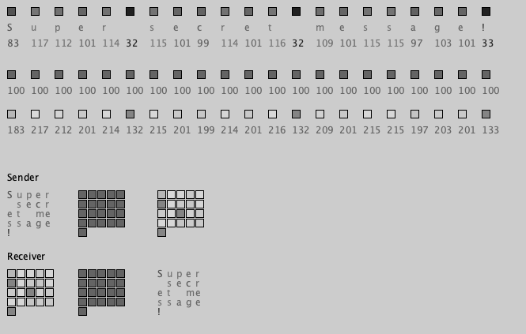
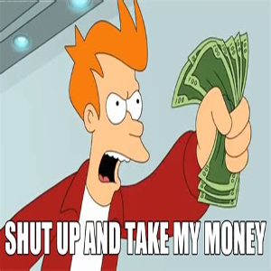
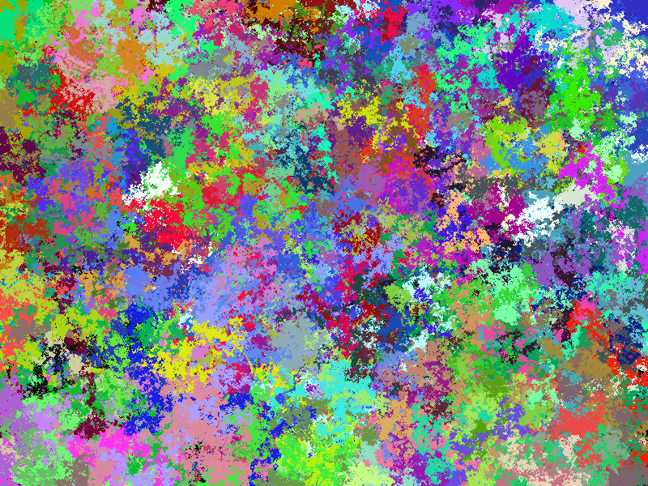

# Hiding in Plain Sight

A 300 by 300 pixel image is made up of 90,000 pixels. Each pixel is made up of 
three values: red, green, and blue. 90,000 times three is 270,000 but it gets 
better. Each color has a range from 0 to 255 inclusive for 256 values so each 
pixel has 16,777,216 meaning a 300 x 300 image has 1,509,949,440,000 (90,000 
times 16.8 million) possible images. Now that's a big number but still
relatively small when talking cryptography and our usable space is slightly 
smaller but it is enough to play with and have some fun. 

The idea is to use the ordinal values of the message to update the color 
values of the image. 

This can be used to loop over the values of a famous meme to encrypt a message. 
As long as all parties have the key they can decrypt the image by comparing the 
two and changing the ordinal values back to characters. 

Key Image

Key Red Values 

[97.0, 129.0, 128.0, 128.0, 126.0, 127.0, 127.0, 127.0, 132.0, 128.0, 127.0, 
128.0, 128.0, 125.0, 125.0, 125.0, 125.0, 125.0, 125.0, 125.0, 125.0, 125.0, 
125.0, 125.0, 125.0, 125.0, 125.0, 125.0, 127.0, 127.0, 127.0, 127.0, 127.0, 
128.0, 128.0, 128.0, 128.0, 128.0, 130.0, 128.0, 128.0, 130.0, 127.0, 125.0, 
135.0, 133.0, 130.0, 131.0, 128.0, 90.0, 65.0, 113.0, 152.0, 157.0, 150.0, 
150.0, 150.0, 150.0, 152.0, 153.0, 151.0, 158.0, 157.0, 150.0, 154.0, 155.0, 
165.0, 140.0, 93.0, 64.0]

Message Values

[104, 116, 116, 112, 115, 58, 47, 47, 100, 114, 105, 118, 101, 46, 103, 111, 
111, 103, 108, 101, 46, 99, 111, 109, 47, 102, 105, 108, 101, 47, 100, 47, 
49, 107, 102, 79, 102, 57, 95, 51, 78, 77, 53, 70, 85, 109, 97, 95, 112, 55, 
107, 88, 84, 95, 119, 106, 50, 81, 122, 121, 69, 54, 108, 55, 95, 47, 118, 105, 101, 119]

Message Image

Final Red Values

[201.0, 245.0, 244.0, 240.0, 241.0, 185.0, 174.0, 174.0, 232.0, 242.0, 232.0, 
246.0, 229.0, 171.0, 228.0, 236.0, 236.0, 228.0, 233.0, 226.0, 171.0, 224.0, 
236.0, 234.0, 172.0, 227.0, 230.0, 233.0, 228.0, 174.0, 227.0, 174.0, 176.0, 
235.0, 230.0, 207.0, 230.0, 185.0, 225.0, 179.0, 206.0, 207.0, 180.0, 195.0, 
220.0, 242.0, 227.0, 226.0, 240.0, 145.0, 172.0, 201.0, 236.0, 252.0, 269.0, 
256.0, 200.0, 231.0, 274.0, 274.0, 220.0, 212.0, 265.0, 205.0, 249.0, 202.0, 
283.0, 245.0, 194.0, 183.0]

But since a meme is easily recognizable it is easier to tell if the colors are
slightly off unless the message is relatively small (300 to 600 characters would
be the first two rows of pixels.) To combat this, it is possible to create 
a number of random walkers, an agent that has the same probability of moving in
any direction, with random color assignments to generate an abstract image. Using 
an abstract image it is very hard to notice if any pixels have been updated with 
a message. It just looks like a cool piece of wall art. 

Taking this concept and expanding it using public/private keys and exploring gifs
which would multiply the 1.5 trillion by the number of frames are next. 
